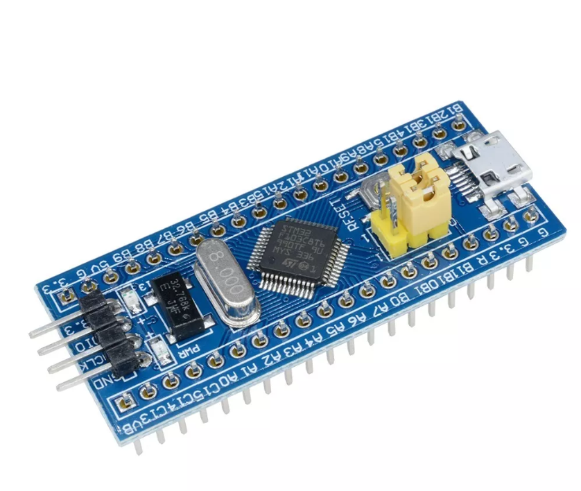

# RTOS-2023.1

Repositório dedicado às atividades da disciplina de Sistemas Operacionais de Tempo-Real na UFC - campus Quixadá.

## Ambiente de Desenvolvimento

- Linux POP!_OS 22.04 LTS

- STM32CubeIDE

- STM32F103C8T6 Cortex-M3 (Blue Pill)

## Embedded Target

