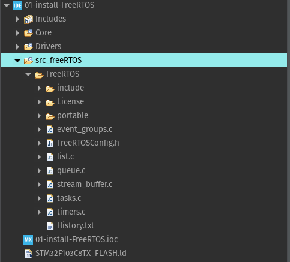
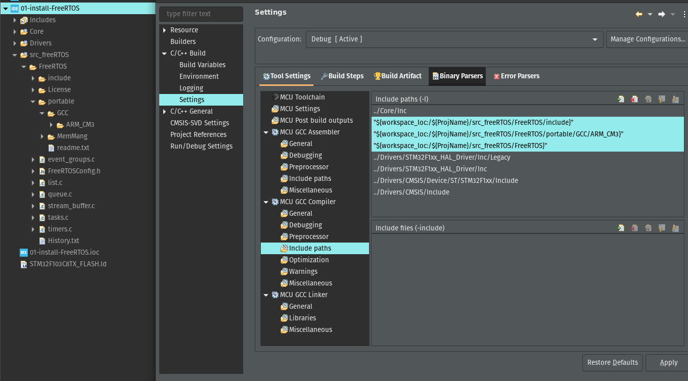
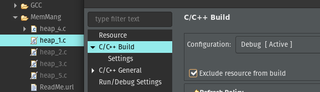

# Instalando o FreeRTOS de forma nativa

Modo alternativo de configurar projetos com FreeRTOS, sem a necessidade de usar a interface CMSIS do STM32CubeIDE, para gerar os arquivos necessários.

## Motivos

De forma empírica, foi notada que há pequenas mudanças nas nomenclaturas e funções quando é analisado os arquivos fontes do FreeRTOS baixado do site oficial e os arquivos gerados pela interface CMSIS, usando o STM32CubeIDE, mas, ambas funcionam normalmente.

Dessa forma, a fim de compreender a estrutura de arquivos do FreeRTOS, resolvi configurar meu próprio ambiente de desenvolvimento do zero, para a placa STM32F103C8T6 (Blue Pill). Por fim, abaixo estará os passos realizados para a configuração, podendo servir até para outros Targets.

## Passo a Passo

- Baixar os arquivos-fontes do FreeRTOS (Github ou site oficial);

- Para a Blue Pill, foi usada a STM32CubeIDE como ambiente de desenvolvimento. Então criando um projeto:

  - File -> New -> STM32 Project -> Escolher a placa;

  - Definir o nome do projeto-> Marcar as opções Target Binary Type e Target Project Type;

- Após criar o projeto, precisa criar uma "Source Folder" e uma subpasta, pois é nela onde será incluída os arquivos do FreeRTOS baixado anteriormente;

- Agora basta extrair os fontes do FreeRTOS e selecionar os arquivos necessários.

  - Na pasta FreeRTOS/Source -> copiar a todos os arquivos e colocar na subpasta, criada no projeto.

  - Na pasta FreeRTOS/ -> copiar a pasta "License" e colocar na pasta subpasta, criada no projeto.

    - estrutura:
    
    

- Agora basta remover os arquivos desnessários para a Blue Pill.

  - Na pasta "portable", irá conter vários códigos port's para diversos processadores. Nesse caso, só é necessário a pasta "GCC" e a "MemMang".

  - Agora é selecionar o processador do Target, no caso seria o Cortex-M3. Então, basta entrar na pasta "GCC" e manter apenas a pasta "ARM_CM3" e apagar as outras.

- Para finalizar a estrutura de arquivos do FreeRTOS, basta adicionar o arquivo "FreeRTOSConfig.h", pois nele contém toda a arquitetura do Kernel RTOS para o Projeto.

  - O "FreeRTOSConfig.h", pode variar dependendo do Target alvo. Para achar a da Blue Pill, basta procurar pela sua referência: stm32f103. Até o presente momento, há 4 pastas com essa referência. Para esse caso, foi utilizado a que contém "stm32f103_keil".

  - Agora basta entrar na pasta "cortex_stm32f103_keil" e copiar o arquivo "FreeRTOSConfig.h" para a subpasta do projeto criado anteriormente. Dessa forma, foi finalizado a Estrutura e Hierarquia do FreeRTOS. Agora, basta fazer o Build para ver há algum erro.

## Observações

- Caso aparecer erros de diretórios, basta incluir os paths das pastas adicionadas ao projeto, indo nas configurações:

- Caso ocorra erros relacionados aos arquivos da pasta "MemMang" durante o Build, basta deletar ou colocar exeção de construção para arquivos "Heap1.c", "Heap2.c", "Heap_3.c" e "Heap_5.c". Fazendo com que seja compilado apenas o arquivo Heap_4.c.

